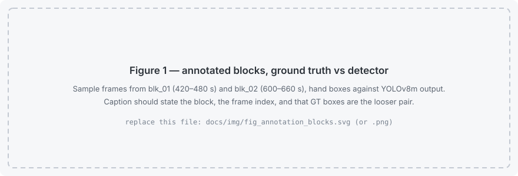
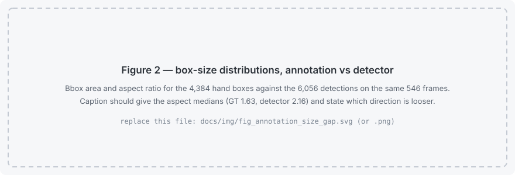

# gaa-kickout-vision
 
Can a published, expert-validated kickout coding scheme for Gaelic
football be reproduced automatically from broadcast video — and how much
of it survives the attempt?
 
---
 
## The premise
 
**McColgan, Bradley, Earle, Gaul & Martin (2026)**, *Identifying and
Defining Kickout Strategies in Senior Inter-County Ladies Gaelic
Football*, Applied Sciences 16(7):3277
([doi:10.3390/app16073277](https://doi.org/10.3390/app16073277), CC BY 4.0),
defined and validated seven kickout strategies, coded 2172 kickouts by
hand in NacSport across five championship seasons, and modelled which
strategies win possession.
 
Two facts from that paper define this project:
 
1. **They had to discard 908 of 3081 kickouts — 29.4% — because
   broadcast camera angles and score replays hid them.** The loss is
   non-random: stronger teams score more, scores trigger replays, replays
   hide the following kickout.
2. **Their conclusion calls for a central Gaelic Games video and tracking
   platform**, because the research is bottlenecked on the video rather
   than on the analysis.
This repository is a prototype of the computer-vision layer such a
platform would need, targeting the variable their own model says matters
most, and measuring honestly how far it gets.
 
---
 
## The headline
 
> **Broadcast footage cannot sustain player identity through a kickout
> contest.** ByteTrack issues 14–20 track identities per real player, not
> one of 14 annotated players is tracked through 80% of its lifetime, and
> ID switches run 1.49× higher within ±5 s of a kickout peak than
> elsewhere (95% CI 1.12–1.98, exact p = 0.0073).
 
Identity fails hardest at precisely the moment the analysis depends on it.
 
---
 
## Results
 
Measured on two hand-annotated 60 s blocks from one 12-minute window:
5,776 boxes, 33 ground-truth identities, YOLOv8m + ByteTrack, pretrained,
no fine-tuning.
 
### Detection
 
| Metric | Value [95% CI] |
|---|---|
| Precision @ IoU 0.5 | 0.272 [0.261, 0.283] |
| Recall @ IoU 0.5 | 0.294 [0.283, 0.306] |
| F1 @ IoU 0.5 | 0.283 [0.271, 0.294] |
| mAP@0.5 | 0.144 |
| **Recall @ IoU 0.3** | **0.463** |
 
The last row is the important one. At a generous overlap bar, **over half
the annotated players still have no detection anywhere near them**. That
is a detection failure, not a matching threshold artefact.
 
### Tracking
 
| Metric | blk_01 | blk_02 | Overall |
|---|---|---|---|
| IDF1 | 0.114 | 0.090 | 0.103 |
| MOTA | −0.172 | −0.578 | −0.332 |
| ID switches | 139 | 74 | 213 |
| Fragmentations | 219 | 148 | 367 |
| GT identities | 14 | 19 | 33 |
| Predicted identities | 283 | 281 | — |
| MT / ML | 0 / 0 | 3 / 2 | 3 / 2 |
 
### ID switches by context
 
| Context | Switches / frame | n |
|---|---|---|
| Within ±5 s of a kickout peak | 0.471 | 72 / 153 frames |
| Elsewhere | 0.315 | 141 / 447 frames |
| **Rate ratio** | **1.49× [1.12, 1.98], p = 0.0073** | 213 switches |
 
### How this baseline was established
 
An earlier annotation pass gave roughly half these detection figures. Its
boxes were systematically loose, and recall rose 2.56× when the IoU
threshold was relaxed from 0.5 to 0.3 — an annotation signature, not a
detection one. After re-annotating tight, that ratio fell to 1.57× while
**recall at IoU 0.3 barely moved (0.473 → 0.463)**. Tightening moved
boxes across the 0.5 threshold; it found no players the detector was
missing. That is how the remaining deficit was established as real.
 
IDF1 *fell* between the two passes (0.147 → 0.103). This is not a
regression. The loose ground truth fragmented identity in the same way
the tracker does — 80 IDs for 14 players — so tracker breaks landed on
ground-truth breaks and the score was flattered. Against continuous
ground truth, every tracker break is now correctly charged.
 
### Not claimed
 
- **Recall by player-size tercile does not test the far-side hypothesis.**
  Small recall (0.317) exceeds large (0.253), which inverts the expected
  scale effect — but the small tercile's median player height is 56 px,
  where `scale_distance` concerns players at 15–25 px. These two blocks
  contain almost no genuinely distant players. Sampling limitation, not
  an analysis choice.
- **Nothing here speaks to hard camera cuts.** Neither block contains
  one; the candidate at 652.5 s was confirmed by hand as a fast pan.
- **The pan does not explain the fragmentation.** Zero switches in the
  10 annotated frames around it against 0.255/frame elsewhere — n far too
  small to resolve. The 14.8× identity inflation is steady-state, spread
  across the whole block.
---
 
## Three properties of the source, measured
 
All point the same way: broadcast footage is produced for viewing, not
for analysis.
 
**Frame-rate conversion upstream of delivery.** Roughly one frame in five
carries no new motion (repeat period ≈ 3.6 frames at 25 fps). Verified
against the raw file to rule out the resampling in `s01` — the raw source
has *more* low-difference frames than the working clip, so the conversion
diluted the pattern rather than creating it. This aliased against a
3-frame velocity window; widening past the repeat period cut
phase-dependence 7× (η² 0.00071 → 0.00010), and the per-phase drift went
from monotonic (+0.06 → −7.33 px/s) to essentially flat.
 
**Framing scale confounds any pixel-space motion feature.** Players
appear 2.3× smaller during kickouts than in open play, because the
broadcast pulls wide to frame a restart and tight to follow the ball. So
`mean_vertical_velocity` is *lower* at contests than elsewhere (ratio
0.62–0.89, never above 1) — the opposite of the leap signature it was
built to capture. The term was actively penalising true kickouts in the
candidate scorer and has been removed. Neither restricting to the nearest
players nor subtracting global camera motion recovers it: pure scaling
predicts 0.435 against 0.694 observed, so real contest motion is present
but swamped by a framing effect roughly twice its size. Logged as
`framing_scale` in `docs/10`, identified pre-audit by hypothesis testing
rather than retrofitted to explain observed errors.
 
**A one-frame offset in the evaluator**, from MOT's 1-based convention,
found and fixed. It would have shifted every box by 40 ms and looked like
a mediocre detector.
 
---
 
## Status
 
| Stage | State |
|---|---|
| s00–s03 ingest, prepare, detect, track | Run on 2 × 12 min windows |
| s04 pitch registration | Built, not run — needs hand-clicked landmarks |
| s05 features | Run, image and pitch space |
| s06 team assignment | Built, not run |
| s07 kickout localisation | Run; velocity term removed |
| s08, s11 coding and agreement | Built, blocked on `s04` and coded events |
| s09 detection and tracking metrics | **Run — see Results** |
| s10, s12 event metrics and failure audit | Blocked on a coded `gt_events.csv` |
| Box annotation | 2 × 60 s blocks, validated |
 
Still outstanding: a properly coded `gt_events.csv` (only a skeleton
exists), the blind re-code that gives the intra-rater ceiling, and the
pitch landmarks that unblock the coding-scheme comparison.
 
---
 
## What it does
 
Designed to detect and track players, register each camera shot to pitch
coordinates, assign players to teams, and reproduce the paper's coding
variables in **metres rather than pixels** — because every one of their
definitions is anchored to a pitch line (players inside the opposition
65, kickouts received inside the 45, an opponent within 2 m, four players
across the 21).
 
| Target | Status | Why |
|---|---|---|
| **Players inside the opposition 65** | **Primary** | Strongest predictor in their mixed model; a counting task with no judgement, so ground truth is reliable |
| Defensive strategy (zonal / player-to-player / concede) | Secondary | Their definitions are geometric — three rules on nearest-opponent distance and defender count |
| Short vs long | Secondary | Reception point estimated from the landing cluster |
| Contested | Proxy only | "Player gaining possession" needs the ball; reported under a different name |
| Offensive strategies, outcome, shots | Out of scope | Depend on run intent, a keeper–outfield signal, or the ball |
 
Full rationale: [`docs/01_source_paper.md`](docs/01_source_paper.md).

## Results

The primary variable is **not yet measured**: it needs `s04` pitch
registration, which needs hand-clicked landmarks. What follows is what has
actually been measured, with the parts that are not yet trustworthy said
plainly. Empty tables live in
[`docs/09_results_template.md`](docs/09_results_template.md).

### What the footage does to the measurement

Three findings, reached by three unrelated routes, all saying the same
thing: **broadcast footage is optimised for viewing, not for analysis.**
Full write-ups in [`docs/10_failure_taxonomy.md`](docs/10_failure_taxonomy.md).

| Finding | Measurement | Consequence |
|---|---|---|
| **Frame-rate conversion upstream** | 19.1% of raw 28 fps frames near-identical to their predecessor, modal gap 4 frames — measured on the source, before `s01` | Velocity depended on repeat phase. Fixed by widening the difference window past the repeat period: η² 0.00071 → 0.00010 |
| **`framing_scale`** | Contest framing puts players at **0.435×** their open-play apparent size (110.7 px vs 254.4 px mean bbox height) | Pixel velocity is *lower* at contests than in open play (ratio 0.694). The `leap` term was scoring kickouts backwards |
| **Cuts are not separable from pans** | Top inter-frame differences in the annotated blocks reach only 1.1–1.3× p99 | No hard cut can be confirmed without a human watching. `annotation.blocks.confirmed_cuts_s` stays empty rather than thresholded |

### Kickout candidate detection (`s07`, rule mode)

A measurement artefact found and corrected. `leap` rewarded high vertical
velocity; because of `framing_scale` that feature is *lowest* at real
contests, so the term penalised the windows it was meant to promote.
Reproduce either row via `events.rule.terms`.

| | 4-term (with `leap`) | 3-term (removed) |
|---|---|---|
| Kickouts recovered, ±3 s | 4 / 8 | **7 / 8** |
| Median \|offset\| of matches | 1.56 s | **0.80 s** |
| Median score rank of a true kickout | 443 / 1494 | **223 / 1494** |
| Precision@8 | 1 / 8 | 1 / 8 |

Recall roughly doubles and the rank of a true kickout halves — but
precision@8 is unchanged, so what was fixed is a term pointing the wrong
way, **not** the detector's discriminative power, which remains poor.
n = 8 rough timestamps, not coded ground truth.

### Detection and tracking (`s09`) — measured, not yet trustworthy

Two contiguous 60 s blocks of `lgf26_final_w1`, 546 annotated frames,
4,384 hand boxes. Wilson intervals.

| | Value [95% CI] |
|---|---|
| Precision @ IoU 0.5 | 0.134 [0.125, 0.143] |
| Recall @ IoU 0.5 | 0.185 [0.174, 0.197] |
| F1 @ IoU 0.5 | 0.155 [0.146, 0.165] |
| mAP@0.5 | 0.054 |
| IDF1 / MOTA | 0.147 / −0.705 |

> **Do not quote these as detector performance.** They are bounded by
> annotation box tightness, not by the model. GT boxes have aspect ratio
> h/w **1.63** against the detector's **2.16** — on the same players, hand
> boxes are ~2× too wide and ~1.3× too tall. Recall is 2.6× higher at IoU
> 0.3 (0.473) than at 0.5 (0.185), which is the signature of loose boxes
> rather than missed players. The size-tercile table is likewise
> uninterpretable: recall is *highest* on small boxes, because terciles cut
> on GT area and the loosest boxes land in "large". `tools/validate_annotation.py`
> fails this annotation on two structural errors as well. The pretrained
> baseline is currently **unmeasured**, not bad.

### Annotation

<!-- Replace the two files below with the real figures; captions and
     filenames are already wired up so nothing else needs editing. -->



*Figure 1 — Hand annotation against YOLOv8m output on `blk_01` (420–480 s)
and `blk_02` (600–660 s).*



*Figure 2 — Box area and aspect ratio, 4,384 hand boxes against 6,056
detections on the same 546 frames.*

Conventions used when drawing them:
[`docs/img/annotation_conventions.svg`](docs/img/annotation_conventions.svg).

### Throughput and cost

Measured on Modal, A10G, 2026-08-15: `s02` 69.0 fps, `s03` 48.2 fps,
**52.9 GPU-seconds per video-minute** combined. `s02` on CPU is
ffmpeg-bound (85.1% of wall clock) rather than model-bound (12.5%), so the
GPU buys less than the fps figure suggests.

### Still blocked

| | Blocked on |
|---|---|
| Pitch registration, all metre-space variables | Hand-clicked landmarks (`s04 --annotate`) |
| **Players inside the opposition 65** (primary) | The above |
| Event-level P/R, temporal localisation | A real `gt_events.csv`; only the rough-timestamp skeleton exists |
| Failure audit cross-tab | The above, plus human classification — `cause` is empty by design |
| Trustworthy detection/tracking metrics | Re-annotation with tight boxes |

## Quick start
 
```bash
pip install -r requirements.txt
make test          # known-answer statistics tests
make demo          # evaluation half, on synthetic data, no footage needed
```
 
With footage — see [`docs/14_build_schedule.md`](docs/14_build_schedule.md)
for the Tier 1 path, which skips automatic event detection and codes at
manually located timestamps, isolating coding accuracy from detection
accuracy:
 
```bash
python src/s00_ingest.py --file data/raw/match.mp4 --video-id lgf26_final_w1 ...
make tier1 VIDEO_ID=lgf26_final_w1
```
 
---
 
## Pipeline
 
| Stage | Script | Produces |
|---|---|---|
| 00 | `s00_ingest.py` | Content hash, `ffprobe` spec, rights status → registry |
| 01 | `s01_prepare_footage.py` | Constant-frame-rate clip, frames, manifest |
| 02 | `s02_detect.py` | `detections.parquet` (YOLO, person class) |
| 03 | `s03_track.py` | `tracks.parquet` (ByteTrack) |
| **04** | **`s04_register_pitch.py`** | **Per-shot homography + held-out error in metres** |
| 05 | `s05_features.py` | Image features, then pitch features in metres |
| **06** | **`s06_assign_teams.py`** | **Team per track, with confidence and an unassigned class** |
| 07 | `s07_detect_kickouts.py` | Temporal localisation (Tier 2 — skippable) |
| **08** | **`s08_code_kickouts.py`** | **The paper's variables, per kickout** |
| 09 | `s09_evaluate_detection.py` | P/R/F1, mAP, recall by player size, MOTA/IDF1 |
| 10 | `s10_evaluate_events.py` | Temporal P/R/F1 at three tIoU thresholds |
| **11** | **`s11_evaluate_coding.py`** | **Per-variable agreement, the ceiling, the coverage rate** |
| 12 | `s12_failure_audit.py` | A clip per failure, for causal classification |
| 13 | `s13_render_overlay.py` | Overlay incl. pitch projection and a labelled failure |
| 14 | `s14_report.py` | Figures, markdown tables, `metrics.json` |
| 15 | `s15_review_tool.py` | Human-factors sub-study (optional) |
| — | `query.py` | DuckDB SQL over every artefact |

Supporting tools:

| Tool | Purpose |
|---|---|
| `tools/sample_frames_for_annotation.py` | Chooses what to annotate and records why. `--mode blocks` (contiguous, interpolable, yields track IDs) or `--mode sparse` |
| `tools/validate_annotation.py` | **Run before trusting any metric.** Structural checks on the labels themselves: MOT16 parse, frame alignment, track-ID usability, continuity, box geometry |
| `tools/extract_segments.py` | Merges padded kickout windows out of an edited compilation |
| `tools/modal_gpu.py` | Runs `s02`/`s03` on a Modal GPU by subprocessing the existing scripts, never reimplementing them |

## Design notes
 
**Pitch registration is load-bearing, not polish.** No variable in the
source scheme is expressible in pixels. `s04` therefore reports
**held-out** reprojection error in metres, which is the floor on
everything downstream: at 2 m RMSE a player within 2 m of the 65 cannot
be classified, and the defender count carries that ambiguity explicitly.
 
**Team assignment fails openly.** Tracks whose kit colour does not
separate cleanly are marked `unassigned` rather than guessed, and the
count of unassigned players inside the 65 becomes a ± band on the primary
variable rather than invisible error.
 
**Time is defined once.** After `s01` the clip is constant-frame-rate and
`timestamp_s == frame_idx / fps` exactly. Container timestamps are never
read back.
 
**Schemas are enforced.** `schemas/tables.yaml` declares every column,
type, key and enum; each write is validated, so a malformed table fails
where it was produced.
 
**Failure is a value, not an exception.** `unassigned` is a legal team,
`unclear` a legal strategy, `codeable = 0` with a reason a legal row. The
coverage rate that falls out of those is a headline result, directly
comparable with the source paper's 29.4% exclusion rate, and it would be
destroyed by a pipeline that guessed rather than abstained.
 
**Statistics are implemented and tested.** The ICC in `src/lib/statsx.py`
matches `pingouin` to 1e-6; the suite pins the behaviours that are easy to
get wrong — one-to-one event matching, absolute-agreement ICC penalising
systematic bias, weighted kappa for the ordered band variable.
 
**Rejected approaches are recorded, not just the chosen one.** Repeat-frame
detection runs on pixels because the track-based alternative was tested
first and topped out at precision 0.40 / recall 0.43 — YOLO box
coordinates jitter ~1.4 px even on a repeated frame against ~4.9 px on a
normal one, and the distributions overlap too much. That rejection is in
the docstring so nobody retries it.
 
---
 
## Benchmarks — and how to quote them
 
The source paper reports inter-operator agreement of κ = 0.981–1.00 on
200 kickouts. **That is not a target for this system.** Their coders
classified kickouts a human had already located and tagged; this pipeline
must locate, register, detect and assign teams before it classifies, and
each stage adds error their figure never absorbed. Their κ benchmarks the
classification step in isolation. Report both framings and name which is
which.

## The split — binding

| Video | Role |
|---|---|
| `lgf26_final_w1` | Development. Annotate, diagnose, tune |
| **`lgf26_final_w2`** | **Never inspected.** The only clean test set left |
| `data_2.mp4` (compilation) | Dropped as a tuning source — editing is a confound |

`lgf26_final_w2` is listed in `annotation.holdout_video_ids`, and the
sampler hard-refuses that id rather than trusting the operator to pass the
right flag. Every number above comes from `w1`.

## Known limitations

- **The current annotation is not usable for metrics.** Boxes are
  systematically loose; `blk_01` is additionally missing 54 of 300
  keyframes and has 20% of rows exported as CVAT shapes rather than
  tracks, which carry no identity. Re-annotation with tight boxes would
  move the numbers more than any model change.
- Two 60 s blocks and one validation block is a thin base. With two blocks
  the only honest split is 1 train / 1 val, so validation is a single 60 s
  passage.
- Velocity is phase-*independent* after the repeat-frame fix, not correct
  in absolute terms — the window is 3× wider, so peak magnitudes are
  roughly halved. Absolute velocities from earlier runs are not comparable.
- `scene_change_flag` is a Jaccard distance over track-ID sets, tuned to
  plausibility and **never validated against hand-marked cuts**. It is an
  identity-churn proxy, not a cut detector.
- n ≈ 15 kickouts from one clip. Every interval is wide. Feasibility
  study, not validation study.
- One coder; intra-rater reliability only, no inter-rater.
- One homography per camera shot, so intra-shot pan and zoom is
  unmodelled drift — measured, not assumed away.
- Foot-point projection is wrong for a leaping player, which is precisely
  what happens at a contest.
- **Pixel-space motion features are confounded by framing.** Because the
  broadcast changes focal length between contest and open play, no
  pixel-velocity feature can be compared across windows. The fix is metres
  via `s04`, which is unproven here and may not survive ~2 m hold-out
  reprojection error on an airborne player's foot point.
- No ball tracking, so `contested` is a proxy under a different name.
- Camera-cut detection is **unresolved**. Mean absolute frame difference
  gives an answer that flips entirely with the threshold (1 cut per 2 s
  to 1 per 80 s across a plausible range), so cut rate is not reported.
  It needs hand-marked cuts or a scale-invariant measure.
- The paper is Ladies Gaelic Football; if your footage is men's GF, kick
  range and rules differ. Do not quote their frequencies as expectations.
---
 
## Data and rights
 
Footage is used **locally for method development** and is not
redistributed. No video, frames, or overlays are committed — enforced by
`.gitignore`, verified by `make check`. Derived artefacts hold box
coordinates, per-clip track indices and a binary team label only: no
identities, no biometric templates, no cross-clip re-identification.
 
`lgf26_final_w2` is held out as the only clean test set and has never
been inspected, tuned or thresholded on; the frame sampler hard-refuses
it by ID rather than relying on the operator.
 
The source paper is CC BY 4.0; its definitions and figures may be reused
with citation, and are cited wherever used.
 
---
 
## Documentation
 
[`docs/`](docs/README.md) — source paper and variable map, data collection
protocol, operational definitions, annotation SOP, data dictionary,
architecture, evaluation plan, statistical analysis plan, results
template, failure taxonomy, human factors, reproducibility, interview
notes, and the tiered build schedule.
